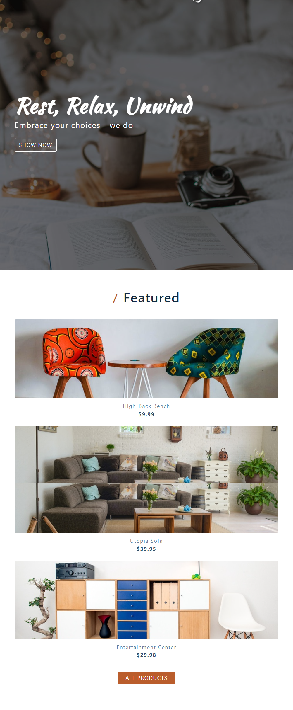
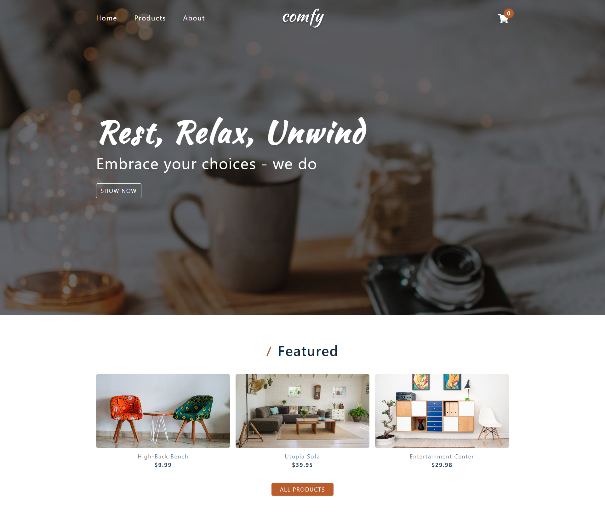

# Comfy Store

## Table of contents

- [Overview](#overview)
  - [Screenshot](#screenshot)
  - [Links](#links)
- [My process](#my-process)
  - [Built with](#built-with)
  - [What I learned](#what-i-learned)
- [Author](#author)

## Overview

### Screenshot

### Links

- Live Site URL: [Link to live site](https://z3shan7.github.io/Ecommerce-project/)

### Built with

- Semantic HTML5 markup
- CSS custom properties
- FLex
- Grid
- modules

### What I learned

i wanted to learn about Ecommerce website how everything work behind

## Author

- Frontend Mentor - [@z3shan7](https://www.frontendmentor.io/profile/z3shan7)
